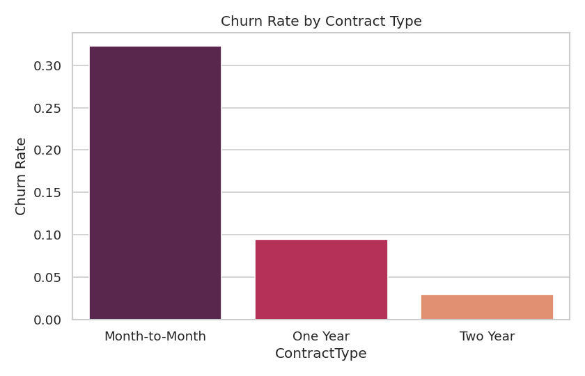
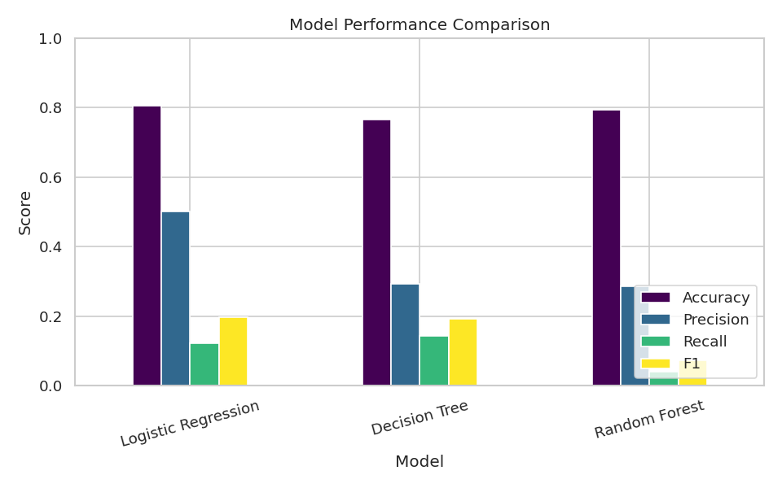
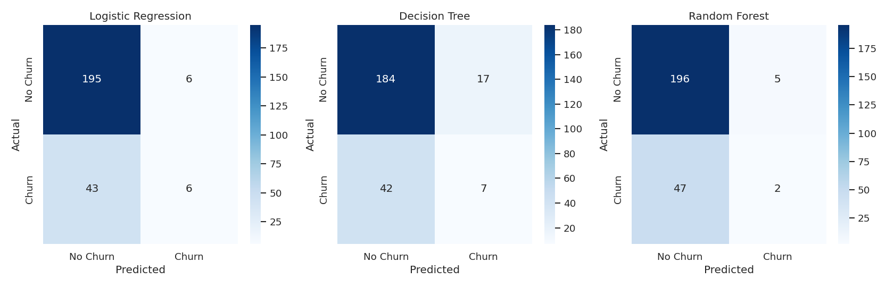
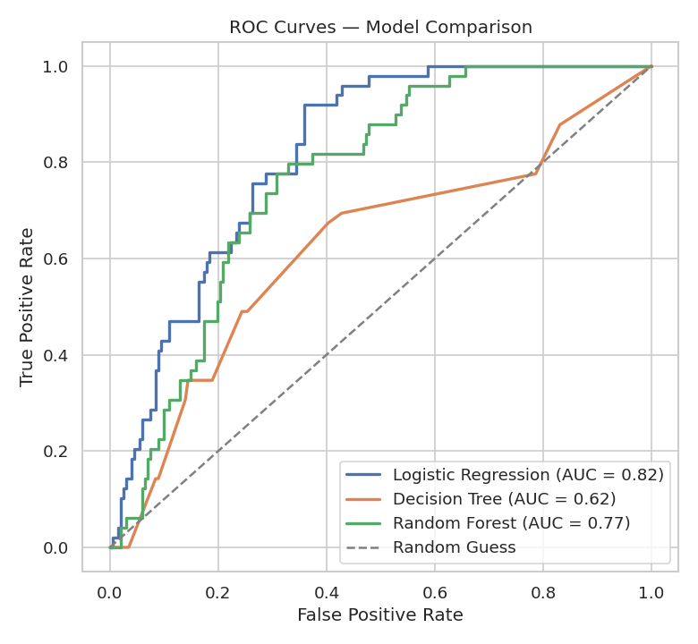
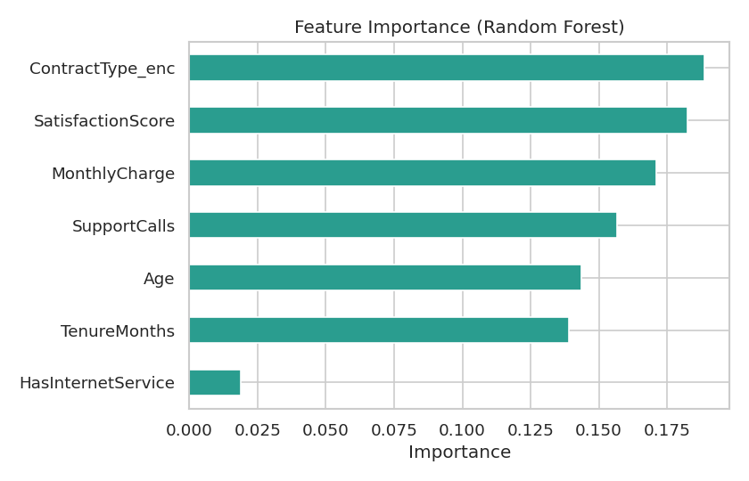

# 🤖 Predictive Modeling Using Machine Learning

Build a model to predict outcomes based on given data — applying **Logistic Regression**,
**Decision Tree**, and **Random Forest** algorithms, training/testing for accuracy, and
visualizing performance using confusion matrices and ROC curves.

**Use case:** Predicting customer **churn** (whether a customer will leave, `1`) based on
account and behavior data — a classic supervised learning / binary classification problem.

---

## 📁 Project Structure

```
predictive-modeling-ml-project/
├── data/
│   ├── generate_data.py            # Creates the synthetic churn dataset
│   └── customer_churn.csv          # Input dataset
├── notebooks/
│   └── train_and_evaluate.py       # Preprocessing, training, evaluation, visualization
├── output/
│   ├── summary_report.json         # Machine-readable summary of the run
│   └── test_predictions_*.csv      # Predictions from the best-performing model
├── visuals/                        # Generated charts (PNG)
└── README.md
```

---

## ⚙️ How to Run

```bash
pip install pandas numpy matplotlib seaborn scikit-learn

python data/generate_data.py                # (optional) regenerate dataset
python notebooks/train_and_evaluate.py      # train models + generate charts
```

Outputs land in `output/` (predictions + JSON report) and `visuals/` (PNG charts).

---

## 🔍 Step 1 — Dataset Overview

| Property | Value |
|---|---|
| Total records | 1,000 customers |
| Features | Age, TenureMonths, MonthlyCharge, SupportCalls, ContractType, HasInternetService, SatisfactionScore |
| Target | `Churn` (1 = left, 0 = stayed) |
| Overall churn rate | 19.5% |
| Train / Test split | 750 / 250 (75/25, stratified) |

### Churn Rate by Contract Type

| Contract Type | Churn Rate |
|---|---:|
| Month-to-Month | 32.3% |
| One Year | 9.5% |
| Two Year | 2.9% |



---

## 🧠 Step 2 — Models Trained

| Model | Notes |
|---|---|
| Logistic Regression | Features scaled with `StandardScaler`; baseline linear classifier |
| Decision Tree | `max_depth=5` to limit overfitting |
| Random Forest | 200 trees, `max_depth=7` |

---

## 📊 Step 3 — Model Performance Comparison

| Model | Accuracy | Precision | Recall | F1 Score | ROC AUC |
|---|---:|---:|---:|---:|---:|
| **Logistic Regression** | **0.804** | **0.500** | 0.122 | 0.197 | **0.818** |
| Decision Tree | 0.764 | 0.292 | 0.143 | 0.192 | 0.623 |
| Random Forest | 0.792 | 0.286 | 0.041 | 0.071 | 0.766 |

🏆 **Best model (by ROC AUC): Logistic Regression**



> **Note:** Recall is low across all models because churners are a minority class (~19.5%).
> In a production setting, this would typically be addressed with class weighting, SMOTE
> oversampling, or a lower decision threshold — noted here as a next step.

---

## 🧩 Step 4 — Confusion Matrices



| Model | True Negatives | False Positives | False Negatives | True Positives |
|---|---:|---:|---:|---:|
| Logistic Regression | 195 | 6 | 43 | 6 |
| Decision Tree | 184 | 17 | 42 | 7 |
| Random Forest | 196 | 5 | 47 | 2 |

---

## 📈 Step 5 — ROC Curves



Logistic Regression achieves the highest area under the curve (AUC = 0.82), indicating the
best overall ability to distinguish churners from non-churners across all thresholds.

---

## 🌟 Step 6 — Feature Importance (Random Forest)

| Feature | Importance |
|---|---:|
| ContractType | 0.189 |
| SatisfactionScore | 0.183 |
| MonthlyCharge | 0.171 |
| SupportCalls | 0.157 |
| Age | 0.144 |
| TenureMonths | 0.139 |
| HasInternetService | 0.019 |



**Takeaway:** Contract type and customer satisfaction are the strongest predictors of churn —
customers on month-to-month contracts with low satisfaction scores are the highest risk group.

---

## 🎯 Expected Outcome

This project demonstrates:
- **Supervised learning** — training and comparing multiple classification algorithms
- **Model evaluation** — accuracy, precision, recall, F1, ROC-AUC, and confusion matrices
- **Interpretability** — identifying which features drive predictions
- **Actionable insight** — contract type and satisfaction are key churn-risk signals

## 🛠️ Tools Used

`Python` · `Pandas` · `NumPy` · `scikit-learn` · `Matplotlib` · `Seaborn`
